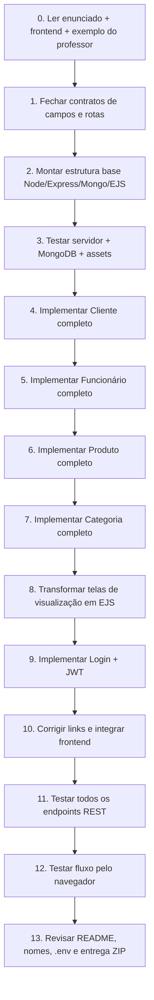
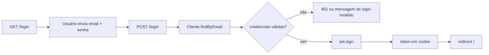
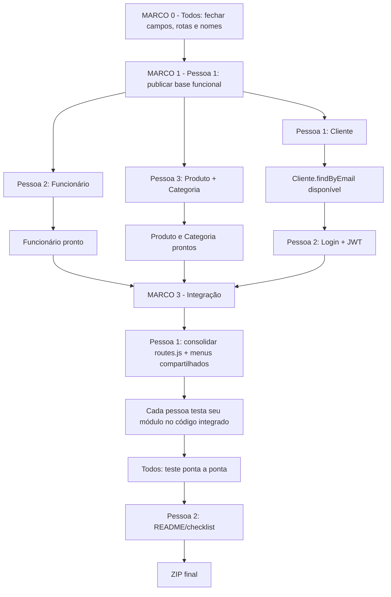

# Xhopii — Fluxo global de desenvolvimento

## 1. Objetivo deste documento

Este arquivo descreve a ordem global de implementação do projeto Xhopii como se uma única pessoa fosse desenvolver tudo do começo ao fim e, em seguida, mostra onde o trabalho pode ser dividido entre três pessoas sem perder as dependências.

A atividade exige:

- Node.js + Express.js;
- padrão MVC;
- Middlewares;
- API RESTful;
- MongoDB com Mongoose;
- EJS;
- login com redirecionamento para a Home;
- JWT;
- CRUD de Cliente, Funcionário e Produto;
- CRUD de um quarto recurso livre;
- visualização em EJS dos dados de Cliente, Funcionário e Produto.

O quarto recurso definido neste planejamento será **Categoria**. Ele terá CRUD RESTful completo, mas não precisa ter tela própria, porque a atividade torna obrigatória a visualização EJS apenas para Cliente, Funcionário e Produto.

> Observação importante: o enunciado anexado diz "atividade avaliativa em dupla", mas este planejamento foi feito para **3 integrantes**, conforme informado pelo grupo. Antes da entrega, confirmem que o professor autorizou trio e coloquem os três nomes/RA no `README.md`.

---

## 2. Regra principal: seguir o padrão do `exemplo-api-mongodb`

A implementação deve permanecer simples e parecida com o exemplo do professor. Portanto, evitar criar camadas que não aparecem no exemplo, como Service, Repository, DTO, Dependency Injection, arquitetura hexagonal etc.

Estrutura-alvo sugerida:

```text
xhopii/
├── assets/
│   ├── css/
│   ├── fonts/
│   └── img/
├── config/
│   └── db.js
├── controllers/
│   ├── AuthController.js
│   ├── ClienteController.js
│   ├── FuncionarioController.js
│   ├── ProdutoController.js
│   └── CategoriaController.js
├── middlewares/
│   └── middlewares.js
├── models/
│   ├── Cliente.js
│   ├── ClienteSchema.js
│   ├── Funcionario.js
│   ├── FuncionarioSchema.js
│   ├── Produto.js
│   ├── ProdutoSchema.js
│   ├── Categoria.js
│   └── CategoriaSchema.js
├── routes/
│   └── routes.js
├── utils/
│   └── pathUtils.js
├── views/
│   ├── login.html
│   ├── home.html
│   ├── cadastrar-cliente.html
│   ├── cadastrar-funcionario.html
│   ├── cadastrar-produto.html
│   ├── visualizar-cliente.ejs
│   ├── visualizar-funcionario.ejs
│   └── visualizar-produto.ejs
├── .env
├── .gitignore
├── package.json
├── README.md
└── server.js
```

Padrão que deve ser repetido para cada recurso:

```text
Schema Mongoose
   ↓
Classe Model simples
   ↓
Controller com métodos static
   ↓
Rotas em routes/routes.js
   ↓
API JSON e/ou renderização EJS
```

Exatamente como no exemplo de `Carro`:

- `CarroSchema.js` define o schema;
- `Carro.js` encapsula chamadas ao Mongoose;
- `CarroController.js` chama a classe `Carro`;
- `routes.js` liga URL + verbo HTTP ao Controller;
- `server.js` registra middlewares, EJS, conexão e router.

---

## 3. Contrato que os 3 integrantes devem fechar ANTES de programar

Esta etapa é curta, mas evita que cada pessoa crie nomes diferentes e depois seja necessário reescrever tudo.

### 3.1 Campos

#### Cliente

```text
nome: String
sobrenome: String
cpf: String, obrigatório e único
dataNascimento: Date
telefone: String
email: String, obrigatório e único
senha: String, obrigatório
foto: String, opcional
```

Os nomes já usados no formulário-base de Cliente são bons e podem ser mantidos: `nome`, `sobrenome`, `cpf`, `dataNascimento`, `telefone`, `email`, `senha`.

#### Funcionário

```text
nome: String
sobrenome: String
cpf: String, obrigatório e único
dataNascimento: Date
telefone: String
cargo: String
salario: Number
email: String, obrigatório e único
senha: String, obrigatório
foto: String, opcional
```

O HTML-base usa nomes como `inputNomeFunc`, `inputSobrenomeFunc`, etc. O integrante responsável pode manter esses nomes e mapear no Controller, ou renomear os `name` dos inputs para os nomes do domínio. A segunda opção deixa o Controller mais simples.

#### Produto

```text
nome: String
fabricante: String
descricao: String
valor: Number
quantidade: Number
foto: String, opcional
```

#### Categoria — quarto recurso

```text
nome: String, obrigatório e único
descricao: String
```

Categoria será independente de Produto na versão obrigatória. Isso permite que o CRUD seja desenvolvido em paralelo e evita criar uma dependência desnecessária. Relacionar Categoria a Produto pode ser feito somente depois, como funcionalidade adicional.

### 3.2 Contrato de rotas REST

Não mudar essas rotas no meio do projeto sem avisar os três integrantes.

```text
CLIENTES
GET    /clientes
GET    /clientes/:id
POST   /clientes
PUT    /clientes/:id
DELETE /clientes/:id

FUNCIONÁRIOS
GET    /funcionarios
GET    /funcionarios/:id
POST   /funcionarios
PUT    /funcionarios/:id
DELETE /funcionarios/:id

PRODUTOS
GET    /produtos
GET    /produtos/:id
POST   /produtos
PUT    /produtos/:id
DELETE /produtos/:id

CATEGORIAS
GET    /categorias
GET    /categorias/:id
POST   /categorias
PUT    /categorias/:id
DELETE /categorias/:id
```

### 3.3 Contrato de rotas WEB

As rotas de tela devem ser diferentes das rotas REST para não existir conflito entre "GET que retorna JSON" e "GET que renderiza EJS".

```text
GET  /login
POST /login
GET  /logout
GET  /

GET /clientes/cadastrar
GET /clientes/visualizar

GET /funcionario/cadastrar
GET /funcionarios/visualizar

GET /produto/cadastrar
GET /produtos/visualizar
```

Exemplo do conflito que deve ser evitado:

```text
GET /clientes -> API deve retornar JSON
GET /clientes -> tela EJS também não pode usar exatamente a mesma rota
```

Por isso, o link "Ver Clientes" do frontend deve apontar para `/clientes/visualizar`.

---

## 4. Fluxo global — como uma única pessoa faria



### Passo 0 — leitura técnica

Antes de codificar, comparar os três materiais:

1. enunciado: define o que é obrigatório;
2. `xhopii_base_views_prontas`: define as telas e o design que devem ser aproveitados;
3. `exemplo-api-mongodb`: define a forma simples de escrever o backend.

### Passo 1 — contrato

Definir campos, URLs e nomes dos arquivos. Esse passo desbloqueia o trabalho paralelo.

### Passo 2 — base do projeto

Usar o exemplo do professor como ponto de partida para criar:

- `package.json` com `type: module`;
- `server.js`;
- `config/db.js`;
- `middlewares/middlewares.js`;
- `routes/routes.js`;
- `utils/pathUtils.js`;
- configuração de EJS;
- `express.static` apontando para `assets`;
- `.env` com `PORT`, `MONGODB_URI` e `JWT_SECRET`.

Dependências npm esperadas no mínimo:

```text
express
mongoose
dotenv
ejs
helmet
compression
express-rate-limit
morgan
nodemon
jsonwebtoken
cookie-parser
```

`jsonwebtoken` é necessário para JWT. `cookie-parser` é a forma mais simples de recuperar o token salvo em cookie durante o fluxo de login via navegador.

### Passo 3 — teste mínimo da infraestrutura

Antes de criar CRUDs, comprovar:

- `npm install` funciona;
- aplicação sobe sem erro;
- MongoDB conecta;
- `/login` abre;
- CSS e imagens aparecem;
- EJS está configurado.

Não começar a integração final sem isso.

### Passos 4 a 7 — CRUDs

Cada recurso segue o mesmo padrão do exemplo de Carro.

Exemplo conceitual:

```text
ProdutoSchema.js
  -> mongoose.Schema(...)

Produto.js
  -> constructor(...)
  -> save()
  -> static findAll()
  -> static findById(id)
  -> static update(id, dados)
  -> static delete(id)

ProdutoController.js
  -> getAllProdutos()
  -> getProdutoById()
  -> createProduto()
  -> updateProduto()
  -> deleteProduto()
  -> renderCreateProduto()
  -> renderAllProdutos()

routes.js
  -> GET /produtos
  -> GET /produtos/:id
  -> POST /produtos
  -> PUT /produtos/:id
  -> DELETE /produtos/:id
  -> GET /produto/cadastrar
  -> GET /produtos/visualizar
```

### Passo 8 — EJS

É obrigatório visualizar no banco, via EJS:

- Cliente;
- Funcionário;
- Produto.

A base já tem `visualizar-cliente.ejs`, o que serve como modelo. O padrão é:

```ejs
<% itens.forEach(item => { %>
    ... usar <%= item.campo %> ...
<% }); %>
```

`visualizar-funcionario.html` deve virar `visualizar-funcionario.ejs`.

Para Produto, aproveitar o layout de `ver-produto.html`, remover os vários produtos estáticos repetidos e gerar os cards com `produtos.forEach(...)`.

### Passo 9 — Login + JWT

Dependência importante: o login precisa de uma forma de encontrar o Cliente pelo e-mail.

Portanto, antes do Auth ficar pronto, `Cliente.js` deve disponibilizar:

```text
Cliente.findByEmail(email)
```

Fluxo simples:



O `login.html` original envia o formulário incorretamente para `/clientes`. Isso precisa ser alterado para:

```html
<form method="POST" action="/login"></form>
```

Os nomes `inputEmailLog` e `inputSenhaLog` podem ser lidos diretamente no `AuthController`.

JWT mínimo:

- segredo em `JWT_SECRET` no `.env`;
- token com `id` e `email` do usuário;
- expiração definida, por exemplo 1 hora;
- middleware que valide o token antes das rotas escolhidas pelo grupo;
- `/logout` limpa o cookie e volta para `/login`.

Não colocar o segredo JWT diretamente no código.

### Passo 10 — integração das Views

Corrigir principalmente:

- `action` vazio no cadastro de Funcionário;
- `action` vazio no cadastro de Produto;
- `action="/clientes"` incorreto na tela de login;
- links `href="#"` de "Ver Funcionários" e "Ver Produtos";
- links relativos quebrados como `login.html`, `ver-produto.html` e `../img/...` quando a aplicação estiver usando rotas do Express.

Rotas sugeridas nos formulários:

```text
Cliente      -> POST /clientes
Funcionário  -> POST /funcionarios
Produto      -> POST /produtos
Login        -> POST /login
```

### Passo 11 — testes REST

Cada recurso deve passar por 5 testes, de preferência no Postman/Insomnia/Thunder Client:

```text
1. POST cria
2. GET lista
3. GET /:id encontra
4. PUT /:id altera
5. DELETE /:id exclui
```

Também testar erros simples:

- ID inexistente;
- CPF repetido;
- e-mail repetido;
- campo obrigatório ausente;
- login inválido;
- token inválido/ausente nas rotas protegidas.

### Passo 12 — teste do navegador

Fluxo mínimo a demonstrar:

```text
/login
  -> login válido
  -> /
  -> cadastrar Cliente/Funcionário/Produto
  -> visualizar Cliente
  -> visualizar Funcionário
  -> visualizar Produto
  -> logout
```

### Passo 13 — entrega

Checklist final:

- nenhum segredo real no ZIP;
- criar `.env.example` se desejado;
- `README.md` com os 3 integrantes e RA;
- explicar como instalar (`npm install`) e executar (`npm run dev` ou `npm start`);
- informar variáveis de ambiente necessárias;
- conferir se `node_modules` precisa ou não ser entregue conforme orientação do professor;
- gerar um único ZIP do projeto final.

---

## 5. Fluxo paralelo para 3 pessoas



### MARCO 0 — contrato obrigatório entre os três

Responsáveis: todos.

Só termina quando os três concordarem com:

- campos dos schemas;
- nomes dos arquivos;
- rotas REST;
- rotas web;
- estratégia do login;
- quais arquivos são "compartilhados" e quem pode editá-los.

### MARCO 1 — base publicada

Responsável: Pessoa 1.

A Pessoa 1 deve subir rapidamente uma versão em que:

- servidor inicia;
- MongoDB conecta;
- assets abrem;
- EJS está ativo;
- existe `routes/routes.js` importado no servidor.

A partir daí, Pessoas 2 e 3 atualizam suas branches e começam a integrar em cima da mesma estrutura.

### MARCO 2 — desenvolvimento realmente paralelo

Pessoa 1:

```text
ClienteSchema.js
Cliente.js
ClienteController.js
visualizar-cliente.ejs
cadastrar-cliente.html
```

Pessoa 2:

```text
FuncionarioSchema.js
Funcionario.js
FuncionarioController.js
visualizar-funcionario.ejs
cadastrar-funcionario.html
AuthController.js (pode começar o esqueleto)
```

Pessoa 3:

```text
ProdutoSchema.js
Produto.js
ProdutoController.js
visualizar-produto.ejs
cadastrar-produto.html
CategoriaSchema.js
Categoria.js
CategoriaController.js
```

### MARCO 2.5 — dependência Cliente → Auth

A Pessoa 2 não deve inventar sua própria consulta de Cliente.

A Pessoa 1 entrega esta interface:

```text
Cliente.findByEmail(email)
```

Somente depois disso a Pessoa 2 termina o login/JWT contra o Model oficial de Cliente.

### MARCO 3 — integração dos arquivos compartilhados

Para reduzir conflitos de Git, **uma só pessoa deve editar os arquivos compartilhados durante a consolidação**.

Responsável sugerido: Pessoa 1.

Arquivos compartilhados:

```text
server.js
routes/routes.js
middlewares/middlewares.js
package.json
menus repetidos nas views
```

Pessoas 2 e 3 devem entregar os imports e blocos de rotas de seus módulos; Pessoa 1 faz a consolidação final em `routes.js`.

### MARCO 4 — testes por dono

Depois do merge:

- Pessoa 1 testa novamente Cliente;
- Pessoa 2 testa novamente Funcionário + Login/JWT;
- Pessoa 3 testa novamente Produto + Categoria.

Não considerar "pronto" apenas porque funcionava na branch individual.

### MARCO 5 — teste de integração conjunto

Todos executam a mesma versão e conferem:

```text
MongoDB -> login -> Home -> CRUDs -> EJS -> JWT -> logout
```

### MARCO 6 — documentação/entrega

Pessoa 2 pode consolidar o `README.md`, mas todos devem revisar.

---

## 6. Arquivos compartilhados: regra para não gerar conflito

| Arquivo                      | Dono de integração                           | Quem pode propor mudanças       |
| ---------------------------- | -------------------------------------------- | ------------------------------- |
| `server.js`                  | Pessoa 1                                     | Todos                           |
| `routes/routes.js`           | Pessoa 1                                     | Todos                           |
| `middlewares/middlewares.js` | Pessoa 1 na integração; Pessoa 2 fornece JWT | Pessoas 1 e 2                   |
| `package.json`               | Pessoa 1                                     | Todos                           |
| `README.md`                  | Pessoa 2                                     | Todos                           |
| `home.html`                  | Pessoa 1                                     | Pessoa 3 se precisar de Produto |
| menus repetidos nas views    | Pessoa 1 no final                            | Todos                           |

Assim, as Pessoas 2 e 3 passam a maior parte do tempo criando arquivos próprios, com pouca disputa de merge.

---

## 7. O que NÃO fazer antes da versão obrigatória funcionar

Para manter o projeto no nível de simplicidade do exemplo do professor, deixar para depois:

- React/Vue/Angular;
- TypeScript;
- Docker;
- Repository/Service/DTO;
- upload real de imagem com Multer;
- relacionamento complexo entre coleções;
- carrinho, pagamento, pedido e frete;
- refresh token;
- permissões complexas por perfil.

Os inputs de arquivo presentes no frontend não tornam upload obrigatório no enunciado. Se o grupo quiser upload real, tratar como funcionalidade adicional somente depois de toda a atividade obrigatória estar concluída.

---

## 8. Critério de "pronto" do projeto

O projeto só deve ser considerado concluído quando:

```text
[ ] Login valida usuário e redireciona para Home
[ ] JWT é criado e validado
[ ] Cliente tem POST/GET/GET ID/PUT/DELETE
[ ] Funcionário tem POST/GET/GET ID/PUT/DELETE
[ ] Produto tem POST/GET/GET ID/PUT/DELETE
[ ] Categoria tem POST/GET/GET ID/PUT/DELETE
[ ] Cliente é listado em EJS a partir do MongoDB
[ ] Funcionário é listado em EJS a partir do MongoDB
[ ] Produto é listado em EJS a partir do MongoDB
[ ] Frontend original continua visualmente reconhecível
[ ] Rotas e links não estão quebrados
[ ] README contém os 3 integrantes/RA, caso o trio esteja autorizado
[ ] Projeto roda após npm install + configuração do .env
```
